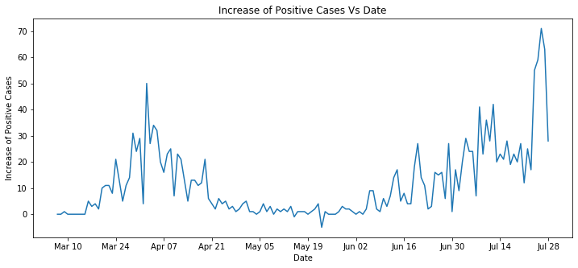
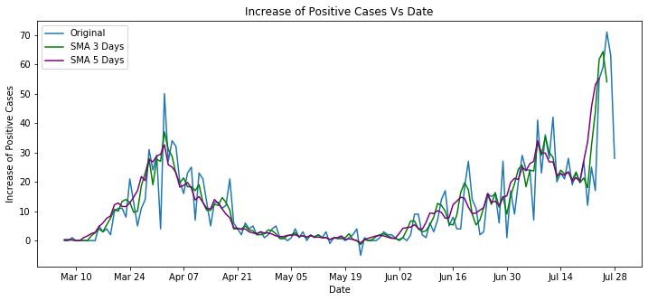
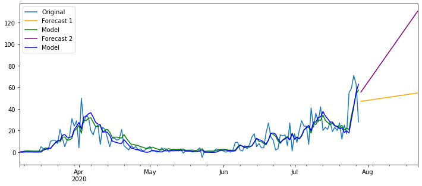

# Forecasting on Hawaii COVID Cases

An analysis project on the number of COVID cases in the State of Hawaii. This state has fortunately seen low cases of COVID compared to other states. However, with lockdowns being lifted and restaurants and shops slowly reopening, numbers are rising. In this project, we analyze the trends in the increase of positive cases with a few simple modelling techniques and try to predict future numbers. All Hawaii state data is taken from [here](https://covidtracking.com/data/download). Data used for this analysis is current up to July 28, 2020.

### A graph of the increase of positive cases:

## A few highlights from the project are:

### Modeling the data with a Simple Moving Average:

### Modeling and forecasting with Exponential Smoothing:

